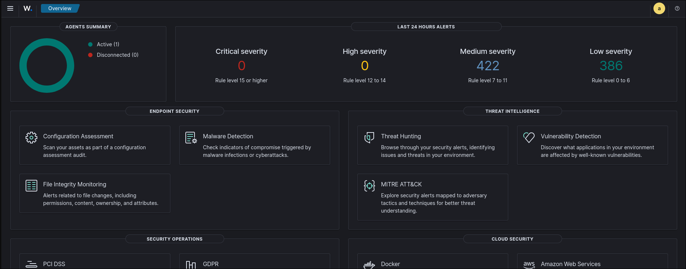
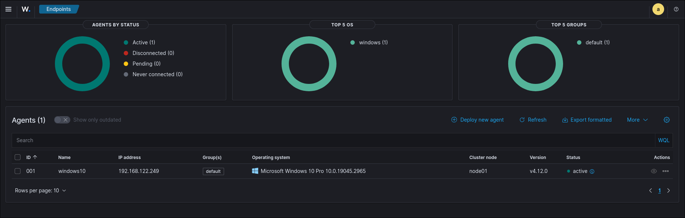
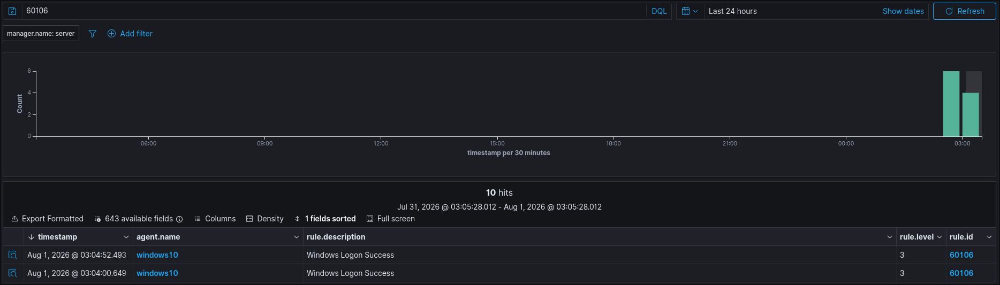
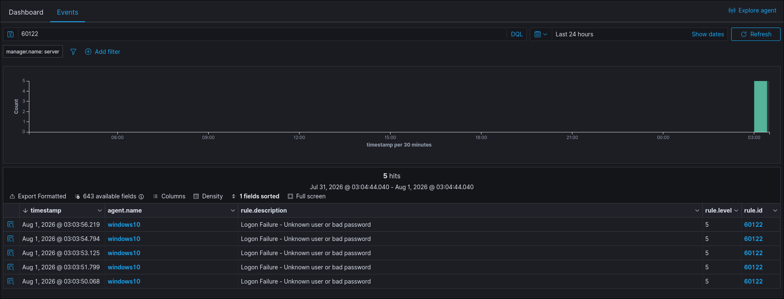
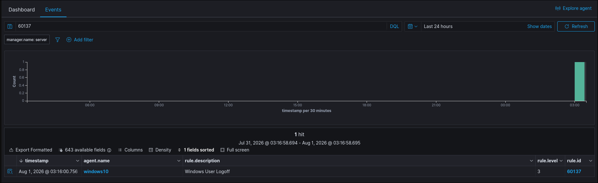

# Wazuh SOC Home Lab

## Overview

This project is a home Security Operations Center (SOC) lab built to practice security monitoring, endpoint visibility, and security event investigation.

The lab uses Wazuh as a SIEM platform to collect and analyze security events from a Windows endpoint. The goal was to simulate basic SOC analyst workflows such as monitoring authentication activity and investigating endpoint events.

---

## Technologies Used

- Wazuh SIEM
- Ubuntu Server
- Windows Endpoint
- Virtualization (KVM/libvirt)
- Windows Event Logs
- Linux administration

---

## Lab Setup

The environment consists of:

- Ubuntu Server hosting the Wazuh platform
- Windows VM acting as a monitored endpoint
- Wazuh Agent forwarding Windows security events to the SIEM dashboard

---

## Detection Scenarios

### Successful Logon (Event ID 4624)

A successful authentication event was generated and analyzed through the Wazuh dashboard.

This demonstrates endpoint visibility and Windows authentication monitoring.

Screenshot:

---

### Failed Logon (Event ID 4625)

Multiple failed authentication attempts were generated to simulate suspicious login activity.

The events were collected and investigated through Wazuh.

Screenshot:

---

### System Shutdown Event

Windows system lifecycle activity was monitored through collected endpoint logs.

Screenshot:

---

## Skills Demonstrated

- SIEM deployment and configuration
- Endpoint monitoring
- Windows event log analysis
- Security event investigation
- Linux server administration
- Virtual machine networking
- Basic SOC workflows

---

## Future Improvements

Planned improvements:

- Add Sysmon telemetry
- Create custom Wazuh detection rules
- Add Active Directory environment
- Perform simulated security incidents
